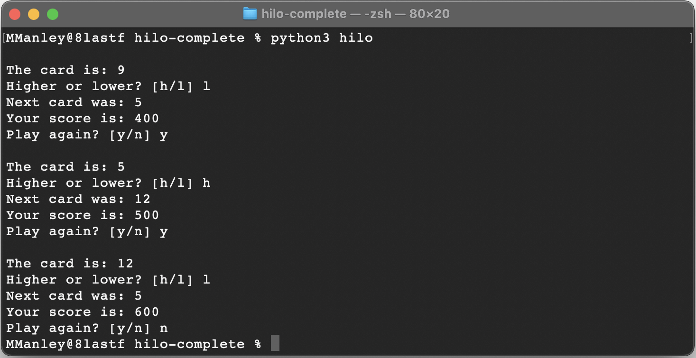

# Hilo Game

## Overview
---
Hilo is a game in which the player guesses if the next card drawn by the dealer will be higher or lower than the previous one. Points are won or lost based on whether or not the player guessed correctly.

## Rules
---
 Hilo is played according to the following rules.

   - The player starts the game with 300 points.
   - Individual cards are represented as a number from 1 to 13.
   - The current card is displayed.
   - The player guesses if the next one will be higher or lower.
   - The the next card is displayed.
   - The player earns 100 points if they guessed correctly.
   - The player loses 75 points if they guessed incorrectly.
   - If a player reaches 0 points the game is over.
   - If a player has more than 0 points they decide if they want to keep playing.
   - If a player decides not to play again the game is over.

## Interface
---

## Design
---
We are going to organize our code in two classes Card y Director

The Card class will be showing a card every time that is called.
The Director Class will be managing the flow of the game and keeping track the score.

## Software Used
---
Visual Studio Code - Code Editor
Git Repository - distributed version control system

## Team Members
---
Alan Montoya - gazalem@hotmail.com
Ronilo Gulay - iloveronilo@gmail.com
Giovanni Bonfim - bon21010@byui.edu
Julie Ann Doricarion - juliemenda@gmail.com

